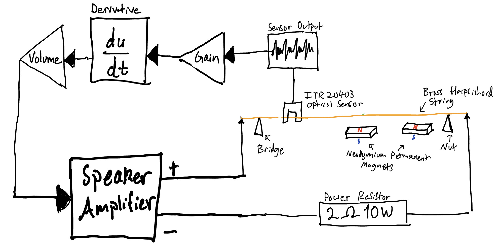

# Electromagnetic Harpsichord

The EM Harpsichord is an augmented harpsichord that uses optical sensors, audio power amplifier chips, and some simple signal processing to sustain vibrations on the brass strings of the harpsichord. This early version uses one circuit board per string you wish to sustain. A work-in-progress performance/demonstration was given on October 2nd, 2023 at the 63rd Annual University of Michigan Organ Conference.

## Working Principle
This simple board uses a ITR20403 Optical Photo-interrupt to sense the vibrations (position) of a harpsichord string. The derivative of this signal is amplified and sent to a 5-Watt audio amplifier chip (PAM8406) that is normally connected to small 4 or 8 ohm speakers. Rather than connect to a speaker, the output terminals of the speaker chip are connected to each end of one of the strings on a harpsichord. The amplified signal pushes current through the string, which generates an alternating magnetic field that interacts with a strong magnetic field from permanent neodymium magnets.

The working principle is similar to the more familiar eBow, but rather sensing and inducing vibrations with electromagnetic coils, we sense with an optical sensor and actuate with Lorentz force actuation.

## Simple System Diagram

This is the signal flow for the sustainer circuit in each board. You need one circuit board for each string you wish to sustain.

## How to order
### JLCPCB
If you wish to have this exact board, you can order these circuit boards from JLCPCB by uploading GERBER-EMHarpsichord_Sustainer+Playback.zip to JLCPCB. Additionally upload BOM-EMHarpsichord_Sustainer+Playback.csv and CPL-EMHarpsichord_Sustainer+Playback.csv to have JLCPCB assemble the board for you.
Note: Double check the orientation of each IC in JLCPCB. They are often incorrect by default.

### Other board house
If you are familiar with a different PCB fabrication, feel free to export as you are familiar would from KiCad.

### Order from me
Alternatively, reach out to me (schmia@umich.edu) in case I have some extra :)

## How to use:
### Wiring up
- The PAM8406 chip is advertised to support 4-8 ohm loads, though the data sheet notes that it can support loads down to 2 ohms. The data sheet also notes that outputs of the PAM8406 amplifier chip have built in short circuit protection, and the outputs will not activate if they detect less than 2 ohm load.
- Therefore, you must ensure that there are at least 2 ohms between the (+) and (-) terminal of each speaker output.
- Most of the brass strings on our harpsichord measured less than 1 Ohm, so we opted to put a 2-Ohm 10W Power Resistor between each string and one of the terminals the selected channels.
- The resistance of a metal string is a function of its material, gauge, length, and temperature. Measure the resistance of

- A 3 Pin JST XH 2.54mm connector supplies 5V, Ground, and an auxiliary audio input

### Magnets
- To induce vibration, the strings must be exposed to a strong magnetic field. We have been using strong neodymium magnets (purchased from kjmagnetics.com) for this purpose. The strength of the vibration is proportional to the strength of the magnetic field, and although the presence of just one or two magnets usually seems to be enough,

### Channels
- The left output channel of the board to the optical sensor which creates a closed feedback loop to sustain vibrations on the connected string.
- The right output channel of the board amplifies an auxiliary input signal

Additional Notes:
	- The optical sensor needs to be placed very precisely over the string to ensure it picks up the vibration. The sensing range of the string is very small and is easy to clip. You can use an oscilloscope on test point 1 (TP1) to make sure the sensor isn't clipping before the gain stage.
	- If it is clipping, consider moving the sensor board closer to a termination point of the string where its range of vibration is much smaller.
	- The feedback loop is very sensitive to the position of the sensor. You will likely notice timbral changes as you change the point on the string where the sensor is located, the position of the sensor over the string, and the positions of the magnets.
	- Bar magnets induce stronger vibrations than cylindrical with the same pull force.

### Notes before ordering/assembling
- If you order based on my files, the optical sensor will be placed on the wrong side of the board. I found it easier to source the components from JLCPCB and desolder/resolder the ITR20403 to the other side of the board. If you can find them for cheap elsewhere, it would probably save you a small headache to order them separately and omit them from the board.

## Design References
- the 'RelevantDocuments' folder holds data sheets and some blog/forum posts I found helpful while designing the board. Dave Corsie's blog helped me figure out how to design the optical pickup circuit and the DIYAudio blog helped me make a better PCB layout for the PAM8406 Chip.

## Future Improvements
### Support Loads < 2 Ohms
One of the most obvious shortcomings of this system is the wasted power. If a given string is only 0.2 Ohms and we compensate with a 2 Ohm resistor, most (~90%) of the power is being dissipated as heat through the resistor rather that contributing towards generating vibrations. I think looking into circuits that are anticipating extremely low loads such as ribbon speakers will be a worthwhile endeavor and likely be a solution for the next version of this circuit.

### Lower Heat Buildup
On the other hand, the large dummy load ensures the majority of the power is dissipated somewhere other than the string, which prevents heat buildup (and thus detuning) in the string. The magnetic field generated by the string is proportional to current only - it does not factor in voltage.

## Software Versions used
KiCad (6.0.7-1)-1 for MaxOS Version 13.4.1
LTSpice 17.0.40 for OS X
